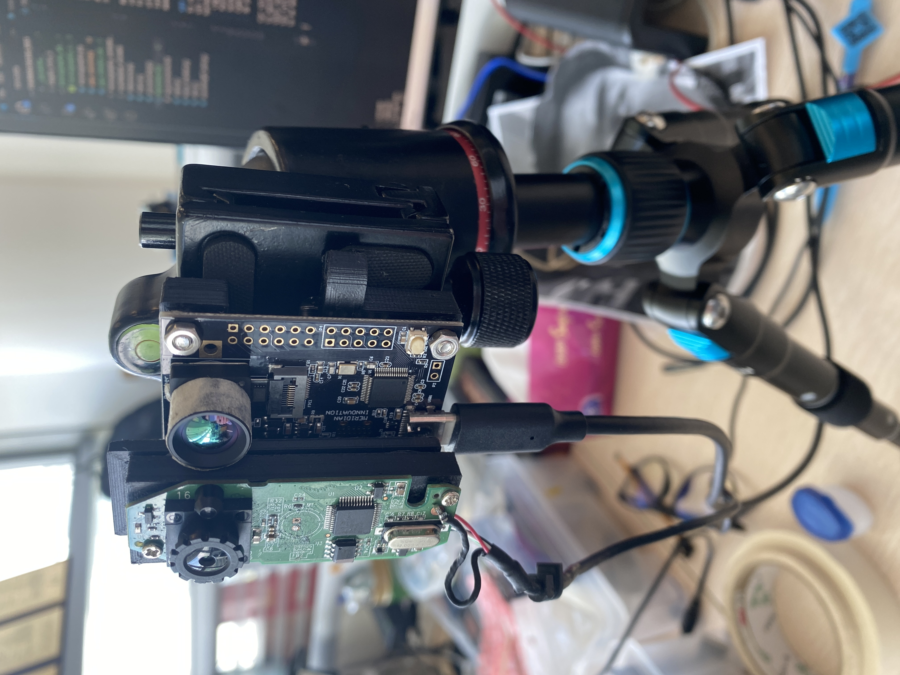

# Introduction:
This directory includes the work of the second iteration of the Depth-Based method inspired by [Liu et al., 2017](https://cvlab.cse.msu.edu/pdfs/FaceAntiSpoofingUsingPatchandDepthBasedCNNs.pdf) that utilises fully convoluted networks to generate estimated thermal mappings, starting with a visual RGB image.

Building upon the first iteration, the second version of our facial anti-spoofing has diverged from using the Yolo framework, and instead utilises MediaPipe (Gemini AI), which offers facial landmark detection with a model that is both memory/computationally more favourable.

# Set Up Guide:
### Hardware:
In order to use this, there are a few things to set up. Firstly, you will need the following hardware:
- Logitech C270 HD Webcam
- Panther 45
- SenXor MI48 compatbile with Panther
- Camera stand/mount
- 3D printed board for this set up (provided file)

For this set up, we have generated a custom board to mount both the visual/thermal cameras with their boards. This board can be 3D-printed using the file: `3dmountprint.stl`. The board is to be mounted on the camera stand.

    

    <i>Ideal set up with the 3D printed mount holding both Panther and Logitech C270 HD webcam.</i>

### Software Environment:
**This will be ideal to set up with Python 3.11**. Any version of Python 3.10+ should suffice. In a virtual environment, install all the necessary packages and libraries by running `pip install -r requirements.txt` from the root directory. You may be prompted to log in to GitHub to install pysenxor. 

### Homography calibration:
Next, you will need to calibrate the visual and thermal cameras to be aligned homographically. This can be completed with the scripts provided in `/homography_alignment`. This folder contains the scripts `pair_record.py`, `pair_stream_calculate.py`, and `verify.py` that will be used in that order. **DO NOT RUN THE FOLLOWING SCRIPTS FROM `homography_alignment`**. From the root directory, i.e. in the `ThermalFaceID_dist` directory, do the following:

1. Run `python homography_alignment/pair_record.py`. Running this script will open up two CV windows; one streaming the webcam, and one streaming Panther's camera.
   - There are several input arguments you can use to accomodate differences in computer set up. The following arguments are:
     - `-webcam_id` (`type=int, default=0`): Webcam ID if default detected webcam is not Logitech cam.
     - `-rotation` (`type=int, default=90`): Rotation for webcam if needed. accepted values are -90,90,180
     - `-colormap` (`type=str, default='inferno'`): Thermal image colormap choice. Options correspond to pysenxor options.

   - There are four keyboard commands: `p` to pause the streams. `r` to resume the streams. `q` to quit and exit. `m` to start recording and saving images.
2. It is recommended that you give 4-5 seconds for Panther to calibrate, and come up close/stay very still in front of both cameras so that your entire face covers majority of the frame. When ready, press `m` and this will start recording the simultaneous streams. It will save the thermal/visual image pairs into a folder called `homography_sampleset` and in separate `thermal` and `visual` folders. The pairs are matched by having the same filename. When you have recorded enough frames(~1-3 seconds), press `q` to quit.

    

    <i>Ref 2: Two CV windows that appear in step 2. Hold still to get clear thermal images.</i>

3. Next create a copy of `homography_coord_template.csv` in the same `/homography_alignment` folder, and name it something different. Preferably, `homography_coord.csv`. If you name it something else, that is ok. Keep in mind you will need to use input arguments in latter scripts if you name it something else.
 

    

    <i>Ref 3: homography_coord.csv structure. Each row populated is visual/thermal image pair.</i>

4. Run `python pair_stream_calculate.py`. Running this script will open a matplotlib window of the visual/thermal image pairs. Additionally ensure that you have your .csv file open (preferably using Microsoft Excel). 
   - There is one input argument you can use. The following arguments is:
     - `-num` (`type=int, default=4`): the number of image pairs to evaluate when populating your .csv file.
5. Each image pair will pop up sequentially. For each image pair, choose four points of interest to pinpoint on both the thermal/visual image. For example, you can choose: left eyebrow, right eyebrow, left nostril, right nostril. Then use the mouse to hover over both the thermal/visual images and get the coordinates of the points for both images (The coordinates are displayed on the bottom-right corner of the matplotlib window).

    

    <i>Ref 4: matplotlib window with two image plots and coordinates at bottom right.</i>

6. Observe Ref 4. Note that each image has 4 points, and the colors correspond to the same 'point', e.g. blue is left eyebrow. Let us call the four points $p_1,p_2,p_3,p_4$. Now, for every image, get the ($x,y$) coordinates for the four points for visual/thermal. Remember that Ref 3 stated each row should be for ONE thermal/visual pair. In the row, if you are getting the coordinates for $p1$. Then the ($x,y$) thermal coordinates will be under x1_thermal, y1_thermal. Similarly, ($x,y$) visual coordinates will be under x1_webcam, y1_webcam.

7. When you finish each image pair, close the matplotlib window, and the next one will open up immediately. **Make sure you keep the .csv file open until you evaluate all images.** There should only be four to evaluate.

8. Once you are done, run `python homography_alignment/verify_homography.py`. Running this script will open a CV window of the visual/thermal image overlay preview. It will be calculating the homography matrix from your .csv file with mapped point pairs, and save the matrix as a JSON file.
   - There is one input argument you can use. The following arguments is:
     - `-filename` (`type=str, default="homography_coord.csv"`): name of homography csv file, e.g. homography_coord.csv
   - The terminal should print out the calculated matrix, and will also open a CV window previewing the projection. If you are not satisfied, you can re-do the process from step 3. Otherwise, once finished, press `q` to close the window and exit.

    

    <i>Ref 5: Overlay preview using calculated homography matrix with inputs from steps 3-6.</i>

# Running Inference Script:

From the root directory, i.e. in the `ThermalFaceID_dist` directory, run `python main.py`. Running this script will execute the final product, which is the basic visual interface running our model inference.
   - There are several input arguments you can use to accomodate differences in computer set up. The following arguments are:
     - `-webcam_id` (`type=int, default=0`): Webcam ID if default detected webcam is not Logitech cam.
     - `-rotation` (`type=int, default=90`): Rotation for webcam if needed. accepted values are -90,90,180
     - `-height_ratio` (`type=float, default=0.75`): Minimum height ratio of frame for face to occupy.
     - `-face_confidence` (`type=int, default=0.7`): Facial landmark detection confidence threshold (MediaPipe parameter)
     - `-liveness_threshold` (`type=float, default=0.04`): liveness threshold.
     - `-heat_threshold` (`type=float, default=1.5`): thermal face variation threshold' options.
   - The interface is simple. RED = ANTI-SPOOF. GREEN = REAL FACE. If there is no box, either the face is too far, there is more than one face, or no face is detected. For detected faces, landmarks will be also drawn.
   - If you want to quit and exit, press `q`.

    

    <i>Ref 6: Visual interface from main.py script.</i>

The default arguments are loaded in through the `config.toml` file. This is because there are several common hyperparameter arguments that can be tuned, and have overlapped usage across multiple scripts. For convenience, if you want to change any of the hyperparameters, you can either do it manually via the argument commads within the command-line terminal, or change the .toml file. The hyperparameters for tuning the model, camera, etc. are under the `"tool"` key.

# Miscellaneous scripts:

In the `/bin` folder, there are two scripts that are used for exploratory purposes as we continue to develop ideas for improving the overall framework. Keep in mind that these scripts are to be run **only after set up is completed**. 

`temp_tracker.py` is a script that displays the same visual interface as `main.py` but includes another window displaying the live temperature reading of a horizontal cut of the face from the nose. The purpose of this was to observe the difference in temperature patterns on horizontal cuts from the nose from real/fake faces.

`wavelength_test.py` is a script that displays the same visual interface as `main.py` but includes another window displaying the attempted live tracking of human 'pulses' from the detected face's forehead. The purpose of this was to see if there could be a detected pulse in temperature change that was different in real faces from fake faces. This idea was inspired by [Yu et al., 2021](https://www.techscience.com/cmc/v68n3/42515/html).

Both scripts have the optional input arguments `-webcam_id`, `-rotation`, `-confidence`, `-height_ratio` that are the same as the input arguments from main.py.

# Generating test statistics on self-collected unseen test data:
**[TO DO]**

# Contact:
If there are any questions, feel free to contact me at takao.kakegawa@meridianinno.com
